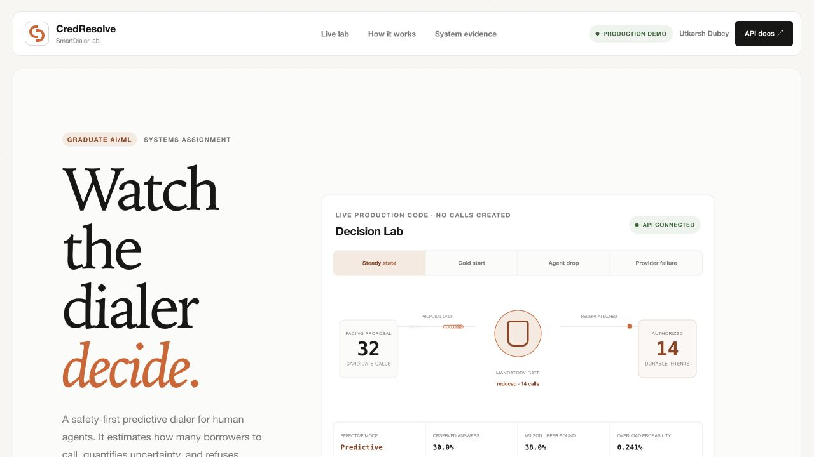
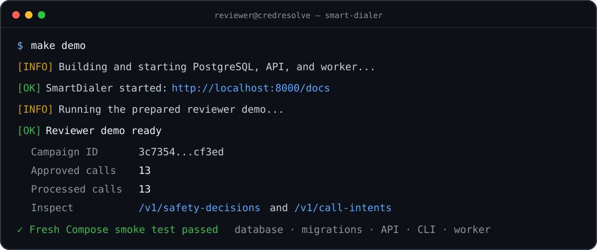

# CredResolve SmartDialer

[](https://github.com/UtkarshDubeyGIT/dubey-smart-dialer/actions/workflows/ci.yml)

A graduate-level **AI/ML systems assignment** and safety-first functional prototype for **human collections agents**. It implements progressive dialing, confidence-bounded predictive pacing, a non-bypassable Safety Controller, PostgreSQL-safe allocation, two deterministic telecom simulators, crash recovery, failure simulations, and contention tests.

No real borrower is called. `PlivoMockProvider` and `BlandMockProvider` make **zero network requests**.

Built by **Utkarsh Dubey** · [GitHub](https://github.com/UtkarshDubeyGIT) · [Email](mailto:utkarsh.dubey.ug23@nsut.ac.in) · [View the live frontend](https://dialer-dashboard.dubey.page/dashboard)

[](https://dialer-dashboard.dubey.page/dashboard)

The image above is the repository's actual responsive frontend, not a concept mockup. Open the live deployment to run the production pacing and Safety Controller path interactively.



## Run it in three commands

Prerequisite: Docker Desktop (or another working Docker Engine with Compose).

```bash
git clone https://github.com/UtkarshDubeyGIT/dubey-smart-dialer.git
cd dubey-smart-dialer
docker compose up --build
```

Wait until Compose reports `api` healthy, then open:

- Dashboard: <http://localhost:8000/dashboard>
- API documentation: <http://localhost:8000/docs>
- Health check: <http://localhost:8000/health>

Expected response: `{"status":"ok"}`.

That is the complete required startup path. Compose starts PostgreSQL, applies Alembic migrations, starts FastAPI, and starts one dialer worker. No `.env`, API key, account, or manual database setup is required.

### Run the prepared demo

In another terminal:

```bash
make demo
```

This seeds 10 human agents, 50 queued borrowers, and a small auditable completed-call history; the production pacing path derives its own answer statistics, runs a predictive decision through the Safety Controller, and processes the approved mock calls. Inspect:

```bash
curl -s http://localhost:8000/v1/safety-decisions | python3 -m json.tool
curl -s http://localhost:8000/v1/call-intents | python3 -m json.tool
curl -s http://localhost:8000/v1/provider-events | python3 -m json.tool
curl -s http://localhost:8000/v1/provider-health | python3 -m json.tool
curl -s http://localhost:8000/v1/incidents | python3 -m json.tool
```

Stop with `docker compose down`. Reset the database too with `make clean`.

## Live reviewer experience

**Public frontend:** <https://dialer-dashboard.dubey.page/dashboard>

The root URL opens a responsive, read-only product walkthrough built by **Utkarsh Dubey**. Its interactive **Decision Lab** lets a reviewer change human capacity, observed answer rate, risk tolerance, and failure scenarios, then watch the production `PredictivePacingEngine` and `SafetyController` approve, reduce, or force progressive mode. `GET /v1/demo/pacing-decision` is side-effect-free and uses the real production decision classes—no call intents are created and no frontend-only safety formula exists.

The same page explains the graduate AI/ML problem, Wilson confidence bound, exact binomial-tail policy, schema-enforced safety receipt, and progressive fallbacks before showing live PostgreSQL evidence: campaign policy, heartbeat-qualified human capacity, recent call intents, provider health, incidents, and the exact receipt authorizing each batch. There is no frontend build step.

## Render deployment

[`render.yaml`](render.yaml) provisions the complete public demo in Singapore: a Docker web service, Docker background worker, and private PostgreSQL 16 database. The web service runs Alembic before deploy, seeds the synthetic reviewer demo once, and sets `PUBLIC_DEMO_READ_ONLY=true` so public visitors cannot mutate the API.

1. In Render, select **New → Blueprint** and connect this repository.
2. Deploy the detected `render.yaml` Blueprint.
3. When the web service is healthy, add `dialer-dashboard.dubey.page` under **Settings → Custom Domains**.
4. Add the DNS record Render provides at the DNS host for `dubey.page`; Render provisions HTTPS after verification.

The local API remains writable because read-only mode is enabled only by the Render environment variable.

## Verify the submission

```bash
make setup       # locked Python 3.12 environment with uv
make test        # 93 unit + real PostgreSQL integration tests
make simulate    # pacing + PostgreSQL-executed failure evidence
make load-test   # reports/load-test.{json,csv}; combined 100/1,000/10,000 table
make smoke       # fresh Compose build, migration, API, CLI, demo, and worker check
make verify      # tests, simulation, compilation, Compose validation
```

`make test`, `make simulate`, and `make load-test` use Testcontainers and ephemeral PostgreSQL 16. Docker must be running; no shared test database is needed. Race tests use separate connections released on a shared barrier, not sequential awaits. Failure simulation executes the real allocation, lease recovery, event inbox, circuit, worker, and presence services; it does not print declared outcomes.

`make smoke` uses an isolated Compose project and temporary host ports, runs the packaged reviewer demo, verifies worker liveness, and removes only its own containers and volume. CI runs this complete startup path on every push and pull request.

If Docker points to a stopped context, select a working one first (Docker Desktop on macOS is commonly `docker context use desktop-linux`).

## Reviewer evidence map

| Question | Implementation | Executable evidence |
|---|---|---|
| Can pacing bypass safety? | Pacing proposes only; every call intent has a schema-enforced `NOT NULL` FK to its persisted Safety Controller receipt. | [`test_coordinator.py`](tests/integration/test_coordinator.py), [`test_migration_safety_boundary.py`](tests/integration/test_migration_safety_boundary.py) |
| Can two workers assign the same human or borrower? | PostgreSQL `SKIP LOCKED`, one transaction, and fixed agent-before-borrower lock order. | [`test_allocation_concurrency.py`](tests/integration/test_allocation_concurrency.py) |
| Are retries safe after ambiguous provider failures? | Durable leases plus provider-local idempotency reconciliation. | [`test_recovery_and_events.py`](tests/integration/test_recovery_and_events.py) |
| Are failure claims simulated or executed? | Worker crash, event disorder, circuit recovery, and heartbeat loss run against ephemeral PostgreSQL; live pacing derives rapid loss from persisted presence transitions. | [`test_failure_simulation.py`](tests/integration/test_failure_simulation.py) |
| Does the packaged application actually start? | CI builds the image, applies migrations, probes the API, runs the demo, checks the CLI and worker, then cleans up. | [`compose-smoke.sh`](scripts/compose-smoke.sh) |

The deliberate tradeoff is a PostgreSQL-backed modular monolith: fewer moving parts and stronger transactional reasoning for the prototype, at the cost of eventually needing worker partitioning and a production connection strategy at larger scale. Statistical conservatism can reduce utilization, but it keeps the safety decision explainable and operator-bounded.

## Implemented

- Explicit human-agent and call state machines.
- Progressive: atomically reserve one human agent and borrower per call.
- Predictive: reserve borrower first; observed answer atomically claims a compatible human.
- One-sided Wilson upper bound plus exact binomial overload tail.
- Answer statistics derived automatically from the latest 200 completed provider calls;
  REST and CLI callers cannot inject counts.
- 0.5% default per-decision risk, 1% hard ceiling, 0% equals progressive.
- Progressive fallback for cold start, stale presence, provider degradation, and rapid agent loss.
- PostgreSQL `FOR UPDATE SKIP LOCKED`, with agent-before-borrower lock order.
- Durable call intents, 30-second leases, three-attempt limit, manual review.
- Unique event constraints and `INSERT ... ON CONFLICT DO NOTHING`.
- Explicit transition jumps, terminal absorption, and separate observed-answer,
  observed-no-answer, and inferred-answer buckets; inferred outcomes never feed pacing.
- PostgreSQL-persisted provider circuit breaker consumed by both workers and pacing,
  with provider-local idempotency, reconciliation, health-check recovery, and jittered retries.
- Fast/reliable Plivo mock and vendor-shaped flaky Bland mock.
- Provider-event-derived setup/talk averages and expected near-term human releases.
- Virtual-time simulator with ringing latency, busy human agents, timed releases,
  provider failures, and measured occupancy; no simulator-only pacing or safety formula.
- REST + CLI operations, CredResolve-inspired read-only dashboard, load test, and CI.

## Architecture


The pacing engine has no allocator/provider dependency. Only a persisted Safety Controller decision authorizes allocation, and PostgreSQL rejects any call intent without that receipt.

Full diagrams: [architecture](docs/architecture.md), [agent state](docs/agent-state-machine.md), [call state](docs/call-state-machine.md).

## API and CLI

FastAPI Swagger at `/docs` contains interactive examples. Core flow:

```text
POST /v1/campaigns
POST /v1/agents
POST /v1/agents/{id}/heartbeat
POST /v1/borrowers
POST /v1/campaigns/{id}/pacing-tick
GET  /v1/safety-decisions
GET  /v1/call-intents
GET  /v1/provider-events
GET  /v1/provider-health
GET  /v1/incidents
GET  /v1/manual-review
GET  /v1/demo/pacing-decision  # side-effect-free interactive explanation
```

```bash
uv run smart-dialer --help
uv run smart-dialer campaign-create "Collections" --mode predictive
uv run smart-dialer agent-create <campaign-id> "Agent One"
uv run smart-dialer borrower-create <campaign-id> B-001 +919999999999
uv run smart-dialer pacing-tick <campaign-id>
uv run smart-dialer list-state
uv run smart-dialer simulate
uv run smart-dialer --json list-state  # stable machine-readable output
```

Commands print short human summaries by default. Validation failures use one-line errors with a corrective hint; `--json` preserves automation-friendly output. The worker logs startup and unexpected iteration failures, then retries instead of silently exiting.

The local API intentionally has no authentication. Production requires service authentication, operator RBAC, and audit trails.

## Design documents

- [Architecture decision record](docs/adr/001-safety-first-modular-monolith.md)
- [Failure scenarios](docs/failure-scenarios.md)
- [Scale analysis](docs/scale.md)
- [Final assignment answer](docs/final-answer.md)
- [Previous IVR reuse assessment](docs/previous-ivr-reuse.md)

## Real telecom scope

Real Plivo integration was scoped out: Plivo requires a business-domain email for account signup, which was not available in the time available, and the assignment marks it optional. The `TelecomProvider` interface allows a real adapter without touching dialer, pacing, allocation, or Safety Controller logic.

A real Bland adapter is also deferred. Its mock retains realistic identity, dispositions, and normalized callback behavior adapted from authorized prior IVR work while staying deterministic and credential-free.

## Troubleshooting

- Port `5432` or `8000` busy: stop the conflict or edit the host-side Compose port.
- API starting slowly: `docker compose ps && docker compose logs api`.
- Testcontainers cannot connect: verify `docker info` in the same terminal.
- Fresh start: `make clean && make up`.
- Worker logs: `docker compose logs -f worker`.
