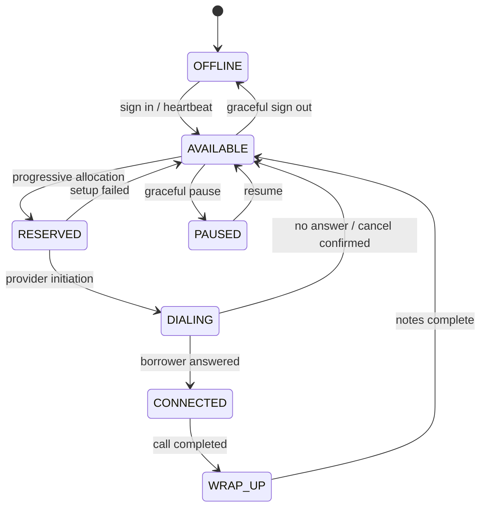

# Human agent state machine

Human workstations heartbeat every 5 seconds. Graceful `PAUSED`/`OFFLINE` is immediate. Silent crash/network loss is detected at 15 seconds. A ringing call first receives a cancellation request and a 10-second reconcile lease; ownership-checked release occurs on confirmation or expiry. Connected disappearance creates an incident and never silently reassigns the borrower.
