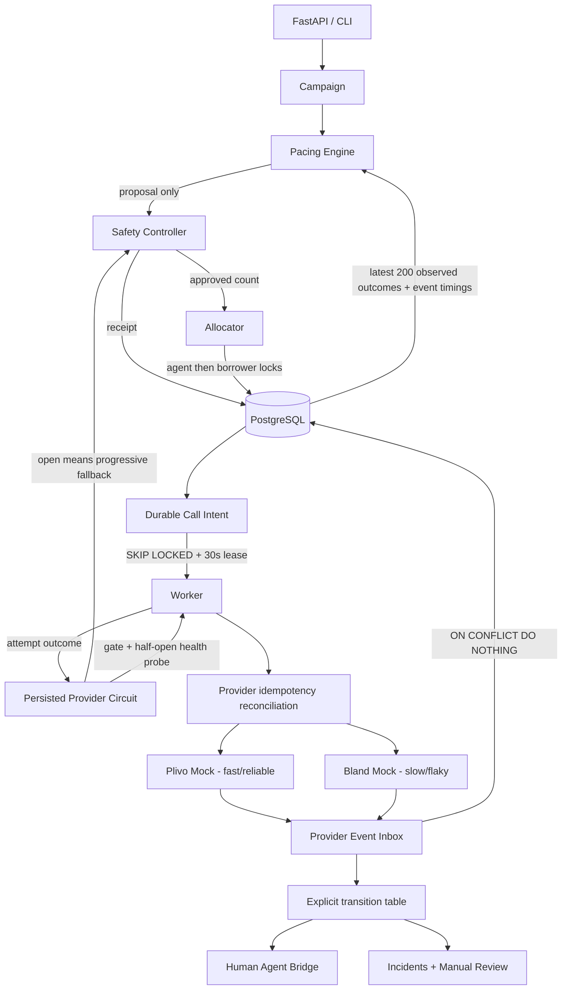
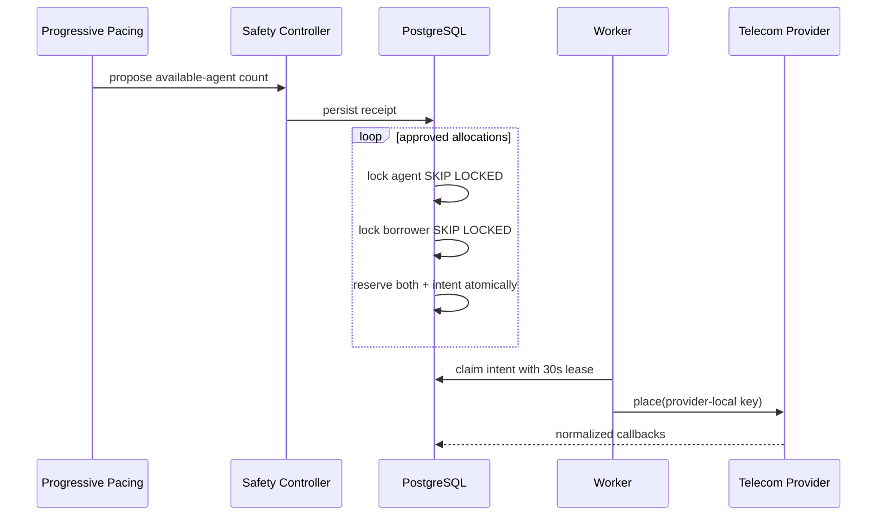
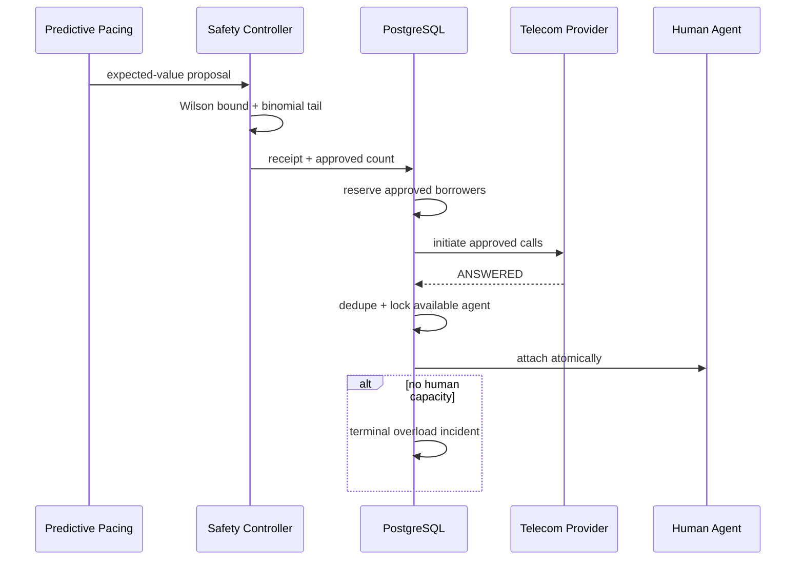

# Architecture

```mermaid
flowchart TB
    API[FastAPI / CLI] --> Campaign
    Campaign --> Pacing[Pacing Engine]
    DB -->|latest 200 observed outcomes + event timings| Pacing
    Pacing -->|proposal only| Safety[Safety Controller]
    Safety -->|receipt| DB[(PostgreSQL)]
    Safety -->|approved count| Allocator
    Allocator -->|agent then borrower locks| DB
    DB --> Intent[Durable Call Intent]
    Intent -->|SKIP LOCKED + 30s lease| Worker
    Worker -->|attempt outcome| Health[Persisted Provider Circuit]
    Health -->|open means progressive fallback| Safety
    Health -->|gate + half-open health probe| Worker
    Worker --> Reconcile[Provider idempotency reconciliation]
    Reconcile --> Plivo[Plivo Mock - fast/reliable]
    Reconcile --> Bland[Bland Mock - slow/flaky]
    Plivo --> Inbox[Provider Event Inbox]
    Bland --> Inbox
    Inbox -->|ON CONFLICT DO NOTHING| DB
    Inbox --> State[Explicit transition table]
    State --> Bridge[Human Agent Bridge]
    State --> Incident[Incidents + Manual Review]
```

## Progressive sequence

```mermaid
sequenceDiagram
    participant P as Progressive Pacing
    participant S as Safety Controller
    participant DB as PostgreSQL
    participant W as Worker
    participant T as Telecom Provider
    P->>S: propose available-agent count
    S->>DB: persist receipt
    loop approved allocations
        DB->>DB: lock agent SKIP LOCKED
        DB->>DB: lock borrower SKIP LOCKED
        DB->>DB: reserve both + intent atomically
    end
    W->>DB: claim intent with 30s lease
    W->>T: place(provider-local key)
    T-->>DB: normalized callbacks
```

## Predictive sequence

```mermaid
sequenceDiagram
    participant P as Predictive Pacing
    participant S as Safety Controller
    participant DB as PostgreSQL
    participant T as Telecom Provider
    participant H as Human Agent
    P->>S: expected-value proposal
    S->>S: Wilson bound + binomial tail
    S->>DB: receipt + approved count
    DB->>DB: reserve approved borrowers
    DB->>T: initiate approved calls
    T-->>DB: ANSWERED
    DB->>DB: dedupe + lock available agent
    DB->>H: attach atomically
    alt no human capacity
        DB->>DB: terminal overload incident
    end
```

PostgreSQL is the only source of truth. There is no cache whose reservation state can disagree with the database.
