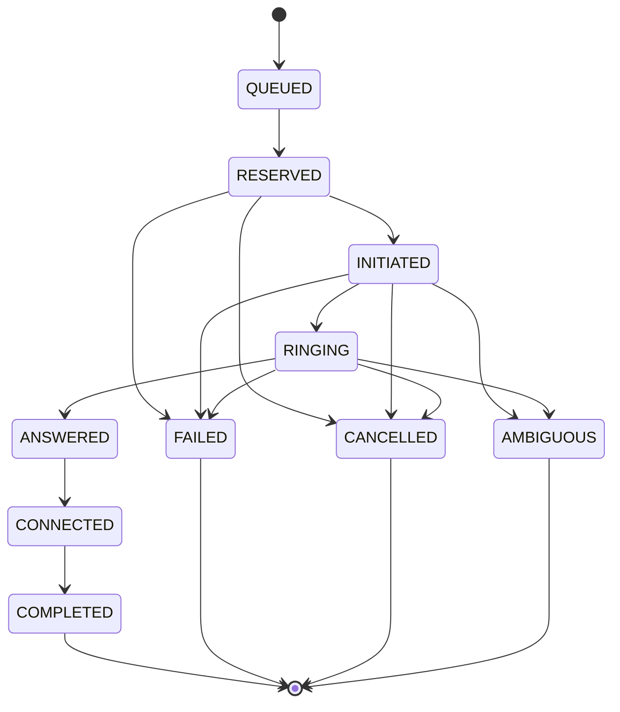

# Call state machine

The code explicitly enumerates valid jumps. `INITIATED -> COMPLETED` is accepted but marks the answer as **inferred**. Only directly observed `ANSWERED` contributes to pacing statistics. Terminal states absorb later events; conflicting terminal events remain audited without replacing the first accepted terminal result.
